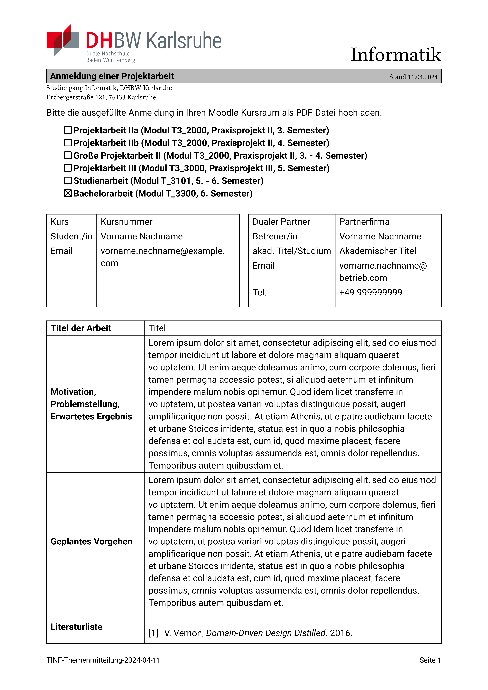

Typst-Template zur Anmeldung von:

- Projektrbeit IIa (Modul T3_2000, Praxisprojekt II, 3. Semester)
- Projektarbeit IIb (Modul T3_2000, Praxisprojekt II, 4. Semester)
- Große Projektarbeit II (Modul T3_2000, Praxisprojekt II, 3. - 4. Semester)
- Projektarbeit III (Modul T3_3000, Praxisprojekt III, 5. Semester)
- Studienarbeit (Modul T_3101, 5. - 6. Semester)
- Bachelorarbeit (Modul T_3300, 6. Semester)

Live Preview automatisches setzen von projekt:
(./recoding.gif)
Basierend auf der Vorlage vom  24.11.2024

Ein Preview der Pdf kann hier gesehen werden: [Beispiel-PDF](./main.pdf)

Compile-Command:
```bash
typst compile --font-path=./fonts main.typ 
```
wenn man dem Dokument einen Namen geben will:
```bash
typst compile --font-path=./fonts main.typ output_name.pdf
```
# Aufbau:
Das Projekt hat folgende Dateien:
1. *main.typ*: Einstiegspunkt zum kompilieren des Dokuments.
2. *data.typ*: Enthält alle spezifischen Informationen wie Studenten-Informationen, Betreuer-Informationen, etc.
3. *modules.typ*: Enthält variablen zur Definition von Projektarbeiten.
4. *template.typ*: Enthält das Temaplate zur Generetion der PDF.

## Daten
data.typ sieht wie folgt aus:
```typst
#import "modules.typ": *

#let module = bachelorarbeit
#let student = "Vorname Nachname"
#let student_email = "vorname.nachname@example.com"
#let student_kurs = "Kursnummer"
#let student_matrikel_nummer = "0000000"

#let titel = "Titel"
#let dualer_partner = "Partnerfirma"
#let anschrift = "Anschrift Optional"
#let betreuer_name = "Vorname Nachname"
#let betreuer_akademischer_titel = "Akademischer Titel"
#let betreuer_telefon_nummer = "+49 999999999"
#let betreuer_email = "vorname.nachname@betrieb.com"
#let problemstellung = [
  #lorem(100)
]
#let geplantes_vorgehen = [
  #lorem(100)
]
#let literatur = "literatur.bib"

#let deutsch = "Deutsch"
#let englisch = "Englisch"
#let datum = datetime(
  day: 10,
  month: 02,
  year: 2025,
)
```
- module: Ist eine Variable aus [modules.typ](./modules.typ)

Interessant ist außerdem [literatur](./literatur.bib). Dabei handelt es sich um ein Literatur-Verzeichnis im bibtex-Format.
Diese Datei wird genutzt um automatisch die Literatur-Liste zu generieren. 


